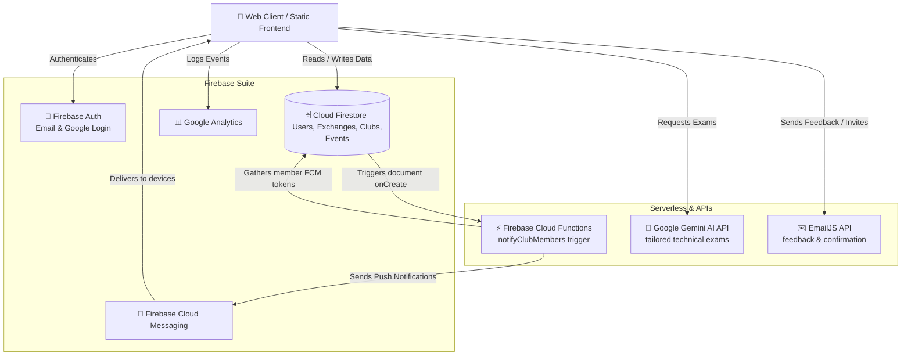

# <p align="center">🧠 ZWAPY — THE NEURAL STUDENT NETWORK</p>

<p align="center">
  <strong>A premium, highly interactive peer-to-peer student platform designed for skill exchange, campus event discovery, and real-world collaboration—pulsing through one central hub.</strong>
</p>

---

## 🌌 Core Philosophy & Value Proposition

**Zwapy** is a "Student Nerve Center" built to unlock campus potential. In a typical university, hundreds of unique skills remain isolated. Zwapy solves this by introducing a frictionless **skill liquidity economy**:

1. **Trade Your Knowledge**: Students offer skills they possess (e.g., frontend engineering) in exchange for skills they need (e.g., video production) using an internal **Skill Coins** economy.
2. **Dynamic AI Validation**: To prevent empty exchanges, **Gemini AI** generates tailored technical exams post-session to verify the learner acquired the skill before credentials or coins are awarded.
3. **Campus Connectivity**: Partnered universities unlock **Premium Portals** allowing local event pulsing and club collaboration, while general students leverage a borderless global exchange pool.

---

## 🏗️ Technical Architecture Diagram

The diagram below illustrates the interactions between standard clients, authentication layers, databases, external APIs, and push services:



---

## 🛠️ The Vanilla HTML to React Migration

This project has been transformed from a collection of static, plain HTML/JS files into a highly modular, state-driven **Single Page Application (SPA)** using **React** and **Vite**.

### Core Architecture Enhancements
1. **Routing Strategy**: Replaced multi-page document requests with client-side routing via `react-router-dom`, resulting in instant, fluid page transitions and zero-refresh navigation.
2. **Context-Driven State**: Replaced ad-hoc global state and manual session polling with a centralized `AuthContext` utilizing the standard Firebase Auth observer (`onAuthStateChanged`).
3. **Component Reusability**: Extracted recurring global structures (like navigationbars, sidebars, background particle systems, custom cursors, and feedback panels) into reusable functional components under `src/components/`.
4. **Style Encapsulation**: Converted style definitions into dedicated CSS files per page/component, preserving the custom glow, nodes, and glassmorphic designs of the original theme while eliminating style pollution.

---

## 📁 Project Directory Structure

```text
Zwapy (React)/
├── public/                  # Static assets (favicons, logos)
├── src/
│   ├── assets/              # Shared images, styling assets
│   ├── components/          # Reusable UI layout elements
│   │   ├── BottomNav.jsx    # Bottom navigation menu for mobile viewports
│   │   ├── CustomCursor.jsx # Smooth customized dynamic follow cursor
│   │   ├── FeedbackModal.jsx# Context-triggered feedback submission modal
│   │   ├── NeuralBackground.jsx # Rich particle neural network canvas background
│   │   ├── Sidebar.jsx      # Sticky main navigation sidebar
│   │   └── Topbar.jsx       # Universal topbar panel with branding
│   ├── context/
│   │   └── AuthContext.jsx  # Firebase Auth session state & user data provider
│   ├── pages/               # Page-level route views (migrated from HTML)
│   │   ├── Landing.jsx
│   │   ├── Login.jsx
│   │   ├── Signup.jsx
│   │   └── [All other pages mapped below...]
│   ├── App.css              # Main app wrapper layouts
│   ├── App.jsx              # Central router configuration
│   ├── index.css            # Global CSS variables, theme variables & resets
│   ├── firebase.js          # Unified Firebase client initialization
│   └── main.jsx             # React DOM entry mounting point
├── vanilla-backup/          # Legacy static .html and .js files
├── package.json             # Build commands and package dependencies
└── README.md                # Project documentation
```

---

## ✨ Primary Modules & User Journeys

### 🔄 1. The Peer-to-Peer Skill Exchange Hub
```
[Post Exchange] ──> [Send Request] ──> [Schedule & Input Zoom ID] ──> [Run Session] ──> [Gemini AI Exam] ──> [Claim Coins]
```
* **Direct Zoom Integration**: To avoid copy-paste hassles, teachers only enter their numerical Zoom Meeting ID. The learner's dashboard automatically creates a direct one-click browser launch link (`zoom.us/j/ID`).
* **Safety Protocols**: Before joining rooms, both participants pass safety checkpoints prohibiting unauthorized recording or inappropriate behavior.
* **Review Multipliers**: Post-session ratings provide a **2x coins multiplier** for instructors receiving 4 or 5-star ratings, promoting exceptional mentoring.

### 📝 2. Anti-Cheat Gemini AI Exam Engine
* **Contextual Questions**: Instead of static pools, **Gemini AI** dynamically crafts technical multiple-choice or coding questions mapped to the scheduled topic and the learner's specified proficiency level (Beginner, Intermediate, Advanced).
* **Anti-Cheat Monitoring**: The active exam environment implements full tab-focus monitoring and keyboard listener lockdowns. Leaving the window triggers visual warnings.
* **Verified Credentials**: Passing the exam updates the student's **Network Rank** and verified skills list. After 5 verified exchanges on a single skill, a custom downloadable certificate is issued.

### 🏛️ 3. Campus Pulse (Premium vs. Public Portals)
* **Presidency University Premium Portal**: Fully unlocked for partnered university domains. Users can join campus-wide **Clubs**, view leader posts, and RSVP to **Events** (hackathons, workshops).
* **Public Portal**: Active for non-partnered students, locking university-specific directories while allowing complete participation in the global p2p Skill Exchange.

---

## 🔔 Triggered Functions Deployment

To host and activate the automated notification system for clubs:
1. Ensure the [Firebase CLI](https://firebase.google.com/docs/cli) is installed and authenticated:
   ```bash
   npm install -g firebase-tools
   ```
2. Log in and initialize:
   ```bash
   firebase login
   ```
3. Deploy the triggered functions located in the `/functions` directory:
   ```bash
   firebase deploy --only functions
   ```

---

## 🗺️ File & Route Mapping Table

The table below illustrates exactly how the legacy Vanilla HTML pages in `vanilla-backup/` have been mapped into the modern React pages (`src/pages/`) and routing paths:

| Legacy File (in `vanilla-backup/`) | React Component (in `src/pages/`) | Active Route | Functional Description |
| :--- | :--- | :--- | :--- |
| `index.html` | [Landing.jsx](./src/pages/Landing.jsx) | `/` | Responsive portal homepage with statistics & features overview. |
| `login.html` / `login.js` | [Login.jsx](./src/pages/Login.jsx) | `/login` | Authentication gate supporting Email & Google Popups. |
| `signup.html` | [Signup.jsx](./src/pages/Signup.jsx) | `/signup` | Member sign up portal with input validation. |
| `extra-details.html` | [ExtraDetails.jsx](./src/pages/ExtraDetails.jsx) | `/extra-details` | Student profile onboarding wizard for courses/skills. |
| `club-extra-details.html` | [ClubExtraDetails.jsx](./src/pages/ClubExtraDetails.jsx) | `/club-extra-details` | Club profile onboarding wizard for managing leads. |
| `dashboard.html` | [Dashboard.jsx](./src/pages/Dashboard.jsx) | `/dashboard` | User command center with exchange counters & coin trackers. |
| `discover.html` | [Discover.jsx](./src/pages/Discover.jsx) | `/discover` | Discover matching profiles with skill search metrics. |
| `network.html` | [Network.jsx](./src/pages/Network.jsx) | `/network` | Presidency-specific network connections & messaging. |
| `profile.html` | [Profile.jsx](./src/pages/Profile.jsx) | `/profile` | Visual resume profile containing skills known/wanted, certificates. |
| `skill-exchange.html` | [SkillExchange.jsx](./src/pages/SkillExchange.jsx) | `/skill-exchange` | Direct P2P request exchange feed for active swaps. |
| `event.html` | [Events.jsx](./src/pages/Events.jsx) | `/events` | Interactive events registration and RSVPs. |
| `clubs.html` | [Clubs.jsx](./src/pages/Clubs.jsx) | `/clubs` | Directory of student clubs, coordinators, and member lists. |
| `Privacy.html` | [Privacy.jsx](./src/pages/Privacy.jsx) | `/privacy` | Campus privacy protocols and user data safeguards. |
| `Terms.html` | [Terms.jsx](./src/pages/Terms.jsx) | `/terms` | Platform term agreements and acceptable use code. |

---

## 🚀 Getting Started

Follow these steps to run the application locally on your machine:

### 1. Installation
Navigate to the project root directory and install the required dependencies:
```bash
npm install
```

### 2. Run the Development Server
Start the local Vite development server:
```bash
npm run dev
```
Once started, the application will be accessible at `http://localhost:5173`.

### 3. Build for Production
To create a production-optimized build:
```bash
npm run build
```

---

## 🔒 Firebase Configuration

Zwapy is integrated with Firebase for Authentication and Firestore. To clean and customize the Firebase connection, you have two options:

### Option A: Using Environment Variables (Recommended)
Create a `.env` file in the root directory of the project and define your credentials. Vite will automatically load them:
```env
VITE_FIREBASE_API_KEY="YOUR_API_KEY"
VITE_FIREBASE_AUTH_DOMAIN="YOUR_PROJECT_ID.firebaseapp.com"
VITE_FIREBASE_PROJECT_ID="YOUR_PROJECT_ID"
VITE_FIREBASE_STORAGE_BUCKET="YOUR_PROJECT_ID.firebasestorage.app"
VITE_FIREBASE_MESSAGING_SENDER_ID="YOUR_MESSAGING_SENDER_ID"
VITE_FIREBASE_APP_ID="YOUR_APP_ID"
VITE_FIREBASE_MEASUREMENT_ID="YOUR_MEASUREMENT_ID"
```

### Option B: Direct Replacement in Config
Alternatively, you can open [src/firebase.js](./src/firebase.js) and directly edit the default fallback string values in the `firebaseConfig` object:
```javascript
const firebaseConfig = {
  apiKey: import.meta.env.VITE_FIREBASE_API_KEY || "YOUR_API_KEY",
  authDomain: import.meta.env.VITE_FIREBASE_AUTH_DOMAIN || "YOUR_PROJECT_ID.firebaseapp.com",
  ...
};
```
